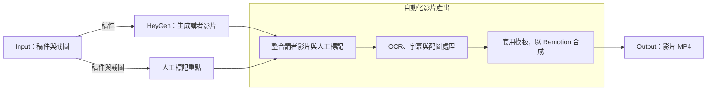
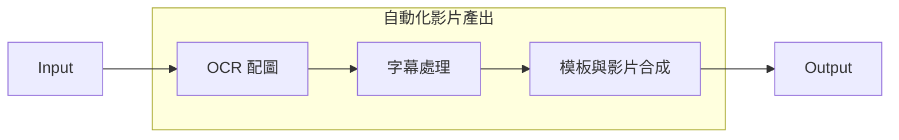
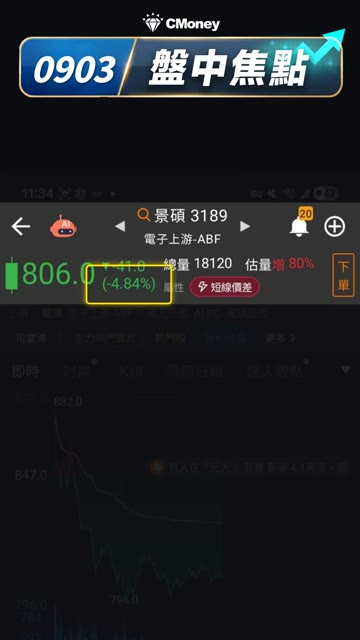

# 影片製作工作台

提供稿件與截圖，結合講者影片、人工標記與固定模板，產出帶有字幕及重點配圖的行銷影片。

## 它怎麼運作

輸入後分成兩條路：系統依稿件產生講者影片，人則標記截圖裡要呈現的重點。兩邊的結果匯入自動化影片產線，最後輸出 MP4。



這張圖呈現的是輸入與成果的關係。實際執行時，部分 OCR、字幕與配圖準備可在人標記期間進行；已有講者影片時，也可以直接沿用，略過 HeyGen 生成。

## 從兩條路徑到一支影片

**系統準備講者，人決定畫面重點。** HeyGen 負責依稿件產生講者影片；人工標記則把稿件內容與截圖中的區域連起來，指定哪些內容需要顯示、框選或滑動。人可以在配圖計畫中調整畫面，再確認出片。

兩邊匯合後，進入自動化影片產出。以下用 Input／Output 省略前後流程，展開區塊內的三項處理：



這是處理內容的簡化概覽；箭頭不代表所有準備工作都必須依序執行。各項處理的技術與分工如下：

| 流程圖中的處理 | 在這個工具裡做什麼 | 與前後步驟的關係 |
| --- | --- | --- |
| **OCR 與配圖** | 辨識截圖中的文字、股名與區域，協助判斷頁型與畫面位置；支援 Tesseract 與 Apple Vision | 結合稿件與人工標記安排配圖。預設正式配圖以人工標記為主，OCR 協助定位，並非自動替人決定所有重點 |
| **字幕處理** | 從講者影片的聲音取得字幕時間軸，再配合稿件與替換規則處理字幕文字 | 將說話內容與時間交給畫面合成，讓字幕與旁白對應 |
| **模板與影片合成** | 使用 [Remotion](https://github.com/remotion-dev/remotion) 將講者、字幕、截圖重點、品牌畫面與音樂組合成影片 | Remotion 負責畫面呈現與渲染；字幕辨識與文字校正由前面的產線處理 |

同一條產線可以套用不同模板。模板決定品牌畫面、字幕位置、截圖呈現方式，以及直式或橫式輸出。下面是從既有成品擷取的實際畫面：

| 盤中焦點 | 大盤小報 | 三大法人 |
| :---: | :---: | :---: |
|  |  |  |
| [直式模板](02_影片模板/盤中焦點/README.md) | [直式與橫式模板](02_影片模板/大盤小報/README.md) | [直式模板](02_影片模板/三大法人/README.md) |

網頁另提供 [焦點股日報](02_影片模板/焦點股日報/README.md) 的直式客製模板。各模板的固定素材、成品範例與程式入口集中在 [模板導覽](02_影片模板/README.md)；OCR 與配圖的細部設定見 [維護說明](90_系統/維護說明/OCR與配圖設定.md)。

**產出的影片會回到這筆工作。** 網頁以完整工作 ID 找到對應影片，供播放與下載；直接打開資料夾，也能在第一層找到 MP4、稿件與這次使用的素材。

## 當前資料夾結構

一次製作是一筆工作。工作自己的內容放在一起，跨工作使用的品牌素材獨立存放；網頁、OCR、字幕與渲染實作集中在系統區。

```text
marketing-video-v2/
├── 工作紀錄/
│   └── 日期_影片名稱_完整jobID/
│       ├── 直式.mp4             ← 直接打開或取用影片
│       ├── 橫式.mp4             ← 有產出橫式時才會出現
│       ├── 稿件.txt
│       ├── 素材/                ← 這次上傳的截圖、講者影片等
│       └── _製作資料/
│           ├── job.json         ← 工作狀態與檔案關聯
│           ├── 快照/            ← 製作時的畫面與生成資料
│           └── 備份/
│
├── 共用素材/                    ← 品牌圖片、音樂、片尾等
├── 02_影片模板/                 ← 可讀模板卡、範例與實作連結
├── 90_系統/
│   ├── 應用程式/                ← 網頁前後端與影片產線
│   ├── 資料/                    ← 詞庫、配圖記憶、留言等正式資料
│   ├── 暫存/產線輸出/
│   ├── 維護說明/
│   └── 測試/
├── 99_封存/                     ← 舊開發資料、過時文件
│   └── 待辨識/                  ← 尚未確認歸屬的備份與試片
├── 出片工具介紹.pptx
├── README.md                    ← 工具導覽
├── AGENTS.md                    ← Agent 共用開發規則
├── CLAUDE.md                    ← Claude 的開發入口
└── package.json                 ← 開發命令入口
```

| 想查看的內容 | 位置 |
| --- | --- |
| 影片、稿件與這次上傳的素材 | [工作紀錄](工作紀錄/) |
| 模板長相、組成與程式入口 | [影片模板](02_影片模板/README.md) |
| 品牌圖片、音樂與片尾 | [共用素材](共用素材/) |
| 網頁與影片產線的開發資料 | [系統導覽](90_系統/README.md)、[Agent 入口](AGENTS.md) |

工作資料夾只呈現實際存在的檔案；橫式影片或製作快照不一定每筆都有。歷史工作即使缺片也會保留，直式與橫式代表輸出版型，目前沒有跨工作 V1／V2 關聯。封存的待辨識區保存尚未確認歸屬的備份與試片。

這份目錄結構對應整理後的副本；既有內網網站尚未切換至此副本。工作與檔案的詳細對應見 [工作與影片位置](90_系統/維護說明/工作與影片位置.md)，啟動與部署見 [啟動與驗證](90_系統/維護說明/啟動與驗證.md)。
