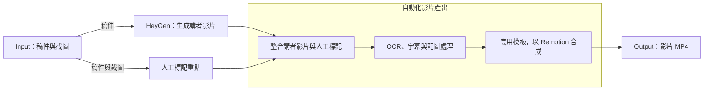
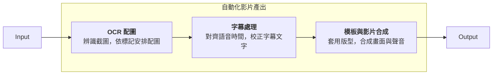
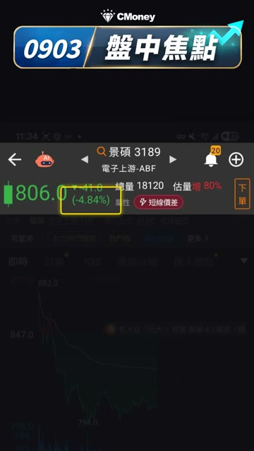

# 影片製作工作台

提供稿件與截圖，結合講者影片、人工標記與固定模板，產出帶有字幕及重點配圖的行銷影片。

## 它怎麼運作

輸入後分成兩條路：系統依稿件產生講者影片，人則標記截圖裡要呈現的重點。兩邊的結果匯入自動化影片產線，最後輸出 MP4。


```mermaid
flowchart LR
    inputMedia["Input：稿件與截圖"]
    heygenVideo["HeyGen：生成講者影片"]
    humanMarks["人工標記重點"]

    inputMedia -->|"稿件"| heygenVideo
    inputMedia -->|"稿件與截圖"| humanMarks

    subgraph productionBlock["自動化影片產出"]
        assembleInputs["整合講者影片與人工標記"]
        arrangeScenes["OCR、字幕與配圖處理"]
        renderMovie["套用模板，以 Remotion 合成"]
        assembleInputs --> arrangeScenes --> renderMovie
    end

    heygenVideo --> assembleInputs
    humanMarks --> assembleInputs
    renderMovie --> outputVideo["Output：影片 MP4"]
```

這張圖呈現的是輸入與成果的關係。實際執行時，部分 OCR、字幕與配圖準備可在人標記期間進行；已有講者影片時，也可以直接沿用，略過 HeyGen 生成。

## 從兩條路徑到一支影片

**系統準備講者，人決定畫面重點。** HeyGen 負責依稿件產生講者影片；人工標記則把稿件內容與截圖中的區域連起來，指定哪些內容需要顯示、框選或滑動。人可以在配圖計畫中調整畫面，再確認出片。

兩邊匯合後，進入自動化影片產出。以下用 Input／Output 省略前後流程，展開區塊內的三項處理：


```mermaid
flowchart LR
    productionInput["Input"]
    subgraph automatedProduction["自動化影片產出"]
        direction LR
        ocrImages["<b>OCR 配圖</b><br/>辨識截圖，依標記安排配圖"]
        subtitleProcessing["<b>字幕處理</b><br/>對齊語音時間，校正字幕文字"]
        templateComposition["<b>模板與影片合成</b><br/>套用版型，合成畫面與聲音"]
        ocrImages --> subtitleProcessing --> templateComposition
    end
    productionInput --> ocrImages
    templateComposition --> productionOutput["Output"]
```

這是處理內容的簡化概覽；箭頭不代表所有準備工作都必須依序執行。各項處理的技術與分工如下：

| 流程圖中的處理 | 在這個工具裡做什麼 | 與前後步驟的關係 |
| --- | --- | --- |
| **OCR 與配圖** | 辨識截圖中的文字、股名與區域，協助判斷頁型與畫面位置；支援 Tesseract 與 Apple Vision | 結合稿件與人工標記安排配圖。預設正式配圖以人工標記為主，OCR 協助定位，並非自動替人決定所有重點 |
| **字幕處理** | 從講者影片的聲音取得字幕時間軸，再配合稿件與替換規則處理字幕文字 | 將說話內容與時間交給畫面合成，讓字幕與旁白對應 |
| **模板與影片合成** | 使用 [Remotion](https://github.com/remotion-dev/remotion) 將講者、字幕、截圖重點、品牌畫面與音樂組合成影片 | Remotion 負責畫面呈現與渲染；字幕辨識與文字校正由前面的產線處理 |

同一條產線可以套用不同模板。模板決定品牌畫面、字幕位置、截圖呈現方式，以及直式或橫式輸出。下面是從既有成品擷取的實際畫面：

| 盤中焦點 | 大盤小報 |
| :---: | :---: |
|  |  |
| [直式模板](docs/templates/midday/README.md) | [直式與橫式模板](docs/templates/dapan/README.md) |

網頁另提供 [美股焦點](docs/templates/usstock/README.md) 的直式模板（尚未擷取預覽畫面）。各模板的固定素材、成品範例與程式入口集中在 [模板導覽](docs/templates/README.md)；OCR 與配圖的細部設定見 [OCR 與配圖設定](docs/ocr-and-shots.md)。

**產出的影片會回到這筆工作。** 網頁以完整工作 ID 找到對應影片，供播放與下載；直接打開資料夾，也能在第一層找到 MP4、稿件與這次使用的素材。

## 當前資料夾結構

程式依職責分成三塊：同事看到的網頁（`app/`）、背後的 API（`server/`）、實際做影片的產線與模板（`video/`）。所有資料集中在 `storage/`；一次製作是一筆工作，影片、稿件與素材都在同一個資料夾。

```text
marketing-workbench/
├── app/                         ← 工作台網頁前台（app.js 入口、js/ 各功能模組）
├── server/                      ← 工作台 API（index.js 開 port、app.js 組裝）
│   ├── jobs/ plan/ corrections/ voice/ messages/ uploads/
│   ├── http/ routes/            ← 驗證、回應、路由器與各組 API
│   ├── deploy/                  ← macOS 自動啟動、自動更新
│   └── tests/
├── video/                       ← 出片
│   ├── run.js                   ← 出片主流程（只做步驟編排）
│   ├── providers/               ← HeyGen、MiniMax（含模擬版）
│   ├── steps/                   ← 講者影片、截圖分析、字幕重轉、動態
│   ├── media/                   ← ffmpeg 加速、模擬用占位影音
│   ├── templates/               ← 版型設定表與解析／素材／渲染
│   ├── subtitles/               ← 字幕轉錄與校正
│   ├── shots/                   ← OCR 與配圖判定
│   ├── pipeline/                ← 其餘產線工具
│   ├── remotion/                ← Remotion 模板（src/）與執行素材（public/）
│   └── tests/
├── shared/                      ← 三塊共用的路徑、工作位置解析、模擬模式開關
├── tools/                       ← init、doctor、verify、e2e、字幕引擎安裝、實驗工具
├── storage/
│   ├── jobs/                    ← 每筆工作（本機）
│   │   └── 日期_影片名稱_完整jobID/
│   │       ├── portrait.mp4     ← 直式成品，直接打開或取用
│   │       ├── landscape.mp4    ← 有產出橫式時才會出現
│   │       ├── script.txt       ← 稿件
│   │       ├── inputs/          ← 這次上傳的截圖、講者影片；motion/ 是動態小影片
│   │       └── _meta/           ← job.json、製作快照 state/、backups/
│   ├── shared-assets/           ← 品牌圖片、音樂、片尾（進 Git）
│   ├── data/                    ← 詞庫、配圖記憶、留言等正式資料（本機）
│   ├── tmp/                     ← 產線暫存輸出（本機）
│   └── archive/                 ← 舊開發資料（本機）
├── docs/                        ← 維護說明、模板導覽、第三方授權
├── package.json                 ← 依賴與所有 npm 命令
├── tsconfig.json                ← Remotion 要求放在 package.json 同層
├── README.md · AGENTS.md · CLAUDE.md
└── node_modules/
```

| 想查看的內容 | 位置 |
| --- | --- |
| 影片、稿件與這次上傳的素材 | [jobs](storage/jobs/) |
| 模板長相、組成與程式入口 | [影片模板](docs/templates/README.md) |
| 品牌圖片、音樂與片尾 | [shared-assets](storage/shared-assets/) |
| 網頁與影片產線的開發資料 | [系統導覽](docs/development.md)、[Agent 入口](AGENTS.md) |

工作資料夾只呈現實際存在的檔案；橫式影片或製作快照不一定每筆都有。歷史工作即使缺片也會保留，直式與橫式代表輸出版型，目前沒有跨工作 V1／V2 關聯。

這份目錄結構對應整理後的副本；既有內網網站尚未切換至此副本。工作與檔案的詳細對應見 [工作與影片位置](docs/job-and-video-locations.md)，啟動與部署見 [啟動與驗證](docs/setup-and-verify.md)。
